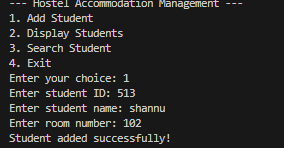
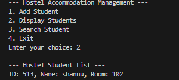
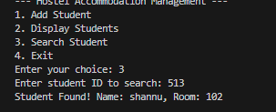
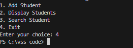

# Hostel Accommodation Management

## Introduction
The Hostel Accommodation Management System is a console-based application developed in C to manage basic information about hostel students. The system allows users to store, view, and search student records efficiently using a simple text-based menu. [attached_file:file:11]

## Purpose
This project demonstrates core C programming concepts—such as structures, arrays, and modular design—while modelling a real-world scenario of managing hostel room allocations. It focuses on clarity and ease of use so that beginners can understand how data can be organized and processed in memory. [attached_file:file:11]

## Features

### Add Student
Allows the user to enter details of a new hostel student, including:
- Student ID  
- Student name  
- Room number  

The record is stored in an in-memory array, and a confirmation message is displayed once the student is added successfully. [attached_file:file:11]

### Display Students
Shows all stored student records in a simple list format. For each student, the program prints:
- ID  
- Name  
- Room number  

This helps the user quickly review the current hostel occupancy. [attached_file:file:11]

### Search Student
Enables the user to search for a student by entering their ID. The program scans the array of students and:
- Prints “Student Found!” with the student’s name and room number if the ID exists.
- Prints “Student not found!” if there is no matching record. [attached_file:file:11]

## Programming Requirements
- ANSI C standard
- Use of a struct to represent each student
- Use of a global array to store multiple students
- Modularized code with separate functions for add, display, and search
- No external libraries required beyond the C standard library [attached_file:file:11]

## How To Use

1. Compile the program:
## How To Use

1. Compile the program:
   ``` bash
    gcc Hostel_accommodation_Management.c
   ``` 
2. Run it in the terminal:
  ```  bash
    ./a.exe
```
    ## Screenshots

- Adding a student  
  

- Displaying all students  
  

- Searching for a student (found)  
  

- Exiting from the main menu  
  

  ## Conclusion
This Hostel Accommodation Management application shows how basic data management tasks—such as inserting, listing, and searching records—can be implemented using structures and arrays in C. It serves as a compact example for students learning how to design menu-driven programs and manipulate collections of structured data. [attached_file:file:11]

## Author
<shannu>  
ITP Project  
SAI University, Chennai
